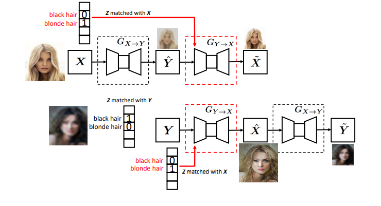
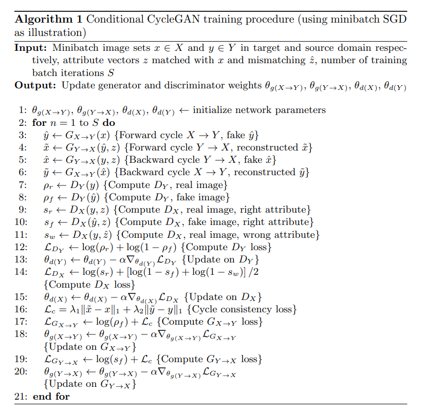

# Attribute-Guided Face Generation Using Conditional CycleGAN

### Architecture

### Algorithm

### Some Note

* If the conditional feature vector always receives the correct attributes,
  the generator network would learn to skip the information in the conditional
  feature vector, since some of the attributes can be found in the low-res face
  image